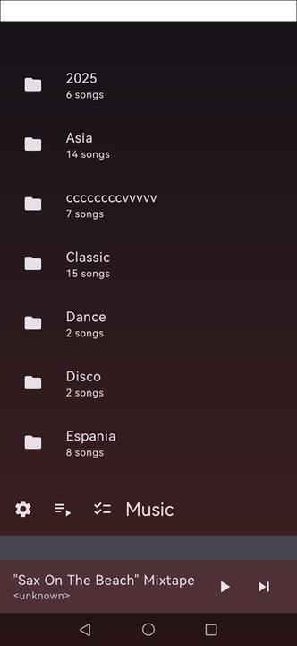
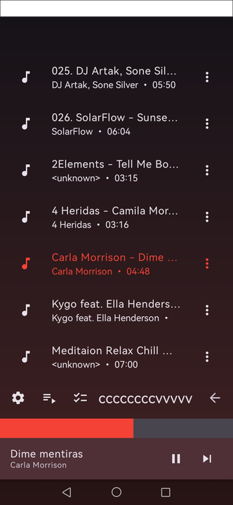
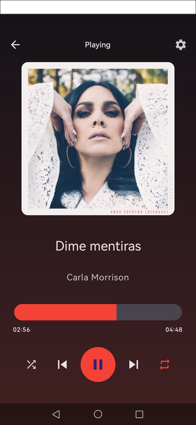
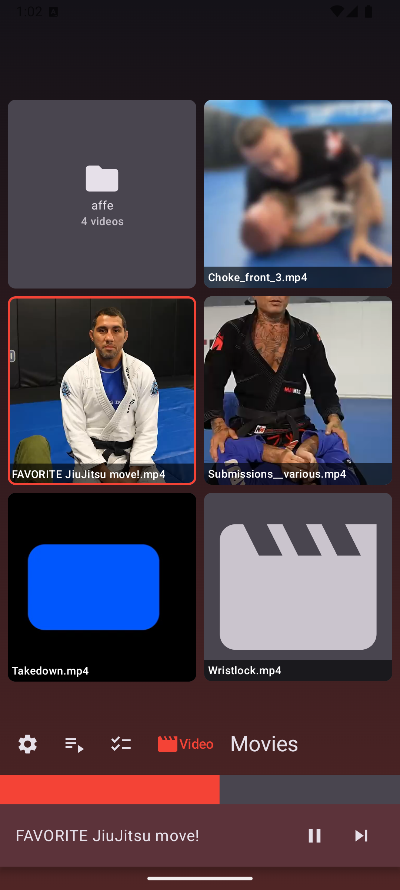
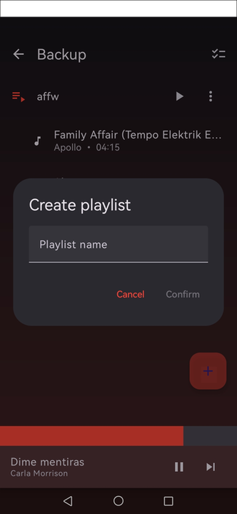
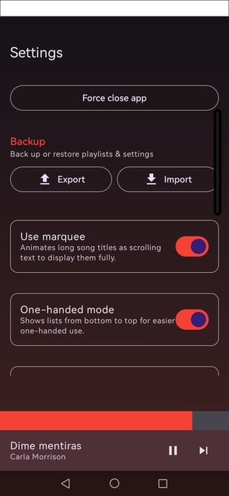

# NewAudio

NewAudio is a modern Android audio and video player built with Jetpack Compose, Media3/ExoPlayer, Room, DataStore, and a local-first file browser.

## Features

- **Audio Playback** - Full-screen and mini player with play/pause, skip, seek, shuffle, repeat, background playback, and notification controls
- **Video Playback** - Dedicated Video mode with inline playback above the mini player and a separate fullscreen video mode
- **Audio/Video Sessions** - Switch between Music and Video while keeping the previous session state; selecting media resumes the last item for that mode when configured
- **File Browser** - Browse configured audio and video folders, including subfolders, one-handed spacer behavior, folder counts, create folder, copy, move, paste, rename, and delete
- **Video Gallery** - Optional thumbnail gallery with 2, 3, or 4 columns, square or portrait-friendly thumbnails, filled/cropped display, and optional filename overlays
- **Video Thumbnails** - Coil video thumbnails with caching, fallback video icons, and folder tiles with names and media counts
- **Video Fullscreen Controls** - Double tap to enter/exit fullscreen, swipe left/right for previous/next video with wrap-around, tap to show timeline, and pinch to switch video fit mode
- **Brightness & Volume Gestures** - In fullscreen video mode, vertical swipe in the upper half adjusts screen brightness; vertical swipe in the lower half adjusts volume
- **Video Markers** - Optional fullscreen-only markers for important video moments, including add, move, delete, previous/next marker navigation, and marker backup/restore
- **Playlist Management** - Separate audio and video playlists with create, edit, reorder, duplicate, export, import, and playback support
- **Backup & Restore** - Export and import playlists, settings, video playlists, and video markers with hash-based matching for restored media
- **Equalizer** - Built-in audio equalizer with configurable bands
- **Bluetooth Autoplay** - Automatically start playback when a Bluetooth device connects
- **Theming & UI Customisation** - Light, Dark, and System themes; custom primary colour; marquee text; progress bar height; transparent list items; settings card style
- **Diagnostics** - Optional in-app error console for development and troubleshooting

## Screenshots

| Audio Browser | Song List | Audio Player |
|:---:|:---:|:---:|
|  |  |  |

| Video Gallery | Inline Video Player |
|:---:|:---:|
|  |  |

| Playlists | Settings |
|:---:|:---:|
|  |  |

## Requirements

| Item | Version |
|---|---|
| Android | 6.0 (API 23) and higher |
| Target SDK | 35 (Android 15) |
| Compile SDK | 35 |
| JDK | 17 |

## Tech Stack

| Layer | Libraries |
|---|---|
| UI | Jetpack Compose, Material 3, Navigation Compose |
| Architecture | Clean Architecture (Domain / Data / Feature), ViewModel, StateFlow |
| Media | Media3 (ExoPlayer, MediaSession, MediaSessionService) |
| Images | Coil Compose, Coil Video |
| Database | Room 2.6 |
| Preferences | DataStore Preferences |
| DI | Hilt 2.51 |
| Serialisation | kotlinx.serialization JSON |
| Async | Kotlin Coroutines + Flow |
| Logging | Timber |
| Testing | JUnit 4, kotlinx-coroutines-test, MockK, Robolectric |

## Build

### Prerequisites

- Android Studio Hedgehog or newer
- JDK 17
- Android SDK 35

### Clone & Run

```bash
git clone https://github.com/mm92ff/NewAudio-player.git
cd NewAudio-player
```

Open the project in Android Studio and run on a device or emulator with API 23 or newer.

### Build APK

```bash
./gradlew assembleDebug
./gradlew assembleRelease
```

### Run Checks

```bash
./gradlew :app:testDebugUnitTest
./gradlew :app:lintDebug
```

## Project Structure

```text
app/src/main/java/com/example/newaudio/
├── data/           # Repository implementations, Room DB, DataStore, scanners, media metadata
├── domain/         # Models, repository interfaces, use cases
├── feature/        # UI screens and ViewModels (browser, player, playlist, settings, console)
├── di/             # Hilt modules
├── receiver/       # Media button, noisy audio, boot receivers
├── service/        # MediaPlaybackService and BluetoothAutoplayManager
└── ui/             # Theme, navigation, main screen
```

## Permissions

| Permission | Purpose |
|---|---|
| `READ_MEDIA_AUDIO` / `READ_MEDIA_VIDEO` | Read audio and video files on Android 13+ |
| `READ_EXTERNAL_STORAGE` | Read media files on older Android versions |
| `WRITE_EXTERNAL_STORAGE` | Legacy file operations on older Android versions |
| `FOREGROUND_SERVICE` + `FOREGROUND_SERVICE_MEDIA_PLAYBACK` | Background playback |
| `WAKE_LOCK` | Keep media playback stable while the screen state changes |
| `MODIFY_AUDIO_SETTINGS` | Equalizer and volume-related playback behavior |
| `BLUETOOTH_CONNECT` / `BLUETOOTH_SCAN` | Detect Bluetooth device connections |
| `RECEIVE_BOOT_COMPLETED` | Restore playback state after reboot |
| `POST_NOTIFICATIONS` | Show playback notification |
| `INTERNET` | Support external media/view intents where needed |

## Notes

- On first start, NewAudio asks for both an audio folder and a video folder. The video folder defaults to Android's standard Movies location when available.
- Video markers are stored locally and exported with media metadata and a file hash so they can be restored on another device when the same files are present.
- Video gallery thumbnails are cached by Coil. The first load may show fallback icons until thumbnails are decoded.

## Contributing

1. Fork the repo
2. Create a feature branch (`git checkout -b feature/my-feature`)
3. Commit your changes (`git commit -m 'feat: add my feature'`)
4. Push to the branch (`git push origin feature/my-feature`)
5. Open a Pull Request

## License

This project is licensed under the [Mozilla Public License 2.0](LICENSE).
