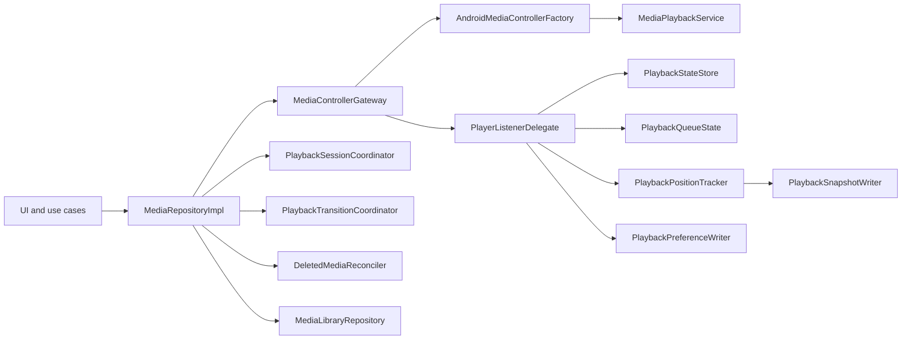
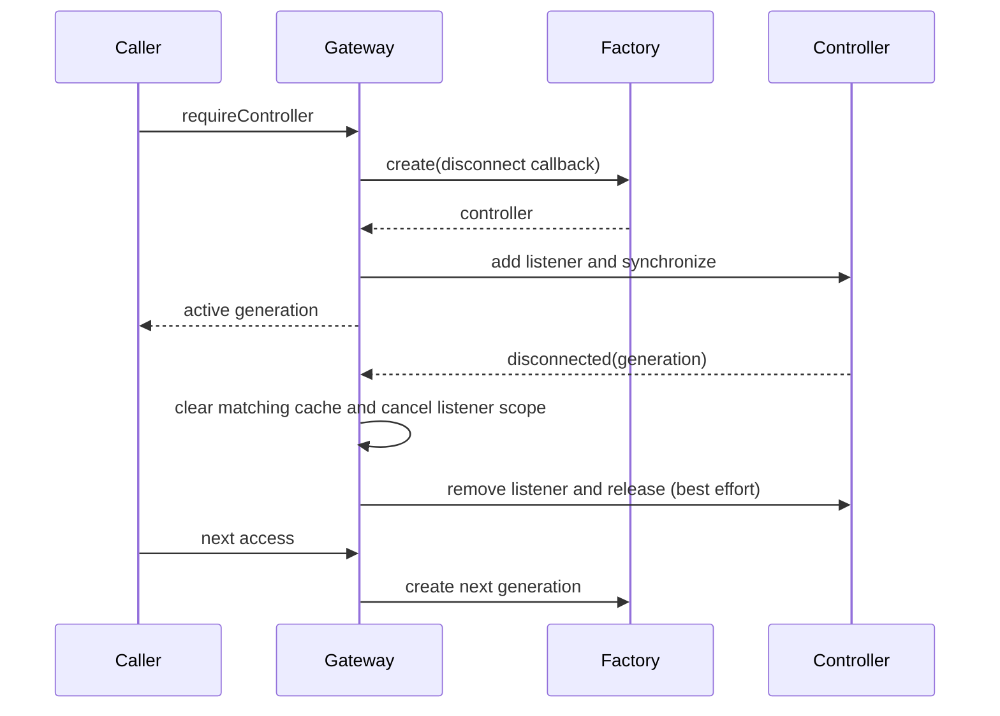

# Media playback architecture

This document describes the durable contracts of NewAudio's playback layer.
The implementation deliberately uses best-effort compensation: Media3 and the
in-memory app stores cannot participate in one atomic transaction.

## Components

`MediaRepositoryImpl` is the application facade. It coordinates collaborators
but does not own Media3 connection creation, database queries, delete planning,
or persistence workers.

## Controller lifecycle

Controller construction is single-flight. Concurrent callers await the same
build without owning its job. Each successful connection receives a monotonic
generation and a listener child scope.

An old disconnect callback cannot clear a newer controller. `release()` is
idempotent for an empty gateway and leaves the gateway reusable. All controller
and listener operations run on the injected main dispatcher.

Only `MediaControllerUnavailableException` from acquisition may become a
best-effort no-op. Cancellation, security/policy failures, setup failures and
exceptions thrown by an operation block propagate unchanged.

## Playback transition commit point

Playlist start, restore and session resume use this order:

1. Capture controller state, relevant app state and stored sessions.
2. Calculate the target without consuming a stored session.
3. Execute Media3 commands.
4. Publish `PlaybackQueueState` and `PlaybackStateStore`.
5. Consume the exact stored session that was previewed.

If step 3 fails, app queue/state and the pending target session remain intact.
The old controller queue, position, preferences and `playWhenReady` intent are
restored best effort. A rollback failure is logged and attached to the primary
error as a suppressed exception.

## Media type priority

The canonical order is explicit Media3 metadata, confirmed database type,
filename extension, then unknown. Explicit audio metadata cannot be overridden
by `.mp4`, and explicit video metadata cannot be overridden by an audio suffix.

## Delete reconciliation

Delete planning is pure. Paths are case-sensitive after slash normalization;
a path matches itself and descendants on a separator boundary, not prefix
siblings. Blank paths, filesystem roots, scheme-only URI roots and dot segments
are rejected. URI and UNC-like inputs otherwise use the same boundary rules.

The reconciler mutates Media3 first. Queue and app state are published only
after all removals, replacement seek and playback-intent commands succeed.
`playWhenReady`, rather than the transient `isPlaying` value, is restored.
Controller rollback is best effort and rollback failures are observable as
suppressed exceptions.

## Threading and ownership

| Component | Execution | Owner/lifetime |
|---|---|---|
| `MediaControllerGateway` | Main dispatcher | Application singleton |
| Controller listener scope | Main plus IO child workers | One controller generation |
| `MediaLibraryRepository` | IO dispatcher | Application singleton |
| `PlaybackSnapshotWriter` | IO dispatcher | Listener child scope |
| `PlaybackPreferenceWriter` | IO dispatcher | Listener child scope |
| `PlaybackPositionTracker` | Listener scope | One controller generation |
| Queue/state stores | Synchronous atomic updates | Application singleton |

Snapshot and preference channels are conflated and serialized. Repeat and
shuffle have independent workers, so neither blocks the other. The position
tracker has at most one ticker and uses monotonic time for auto-save decisions.

## Known limits and release gates

- Compensation is not a true transaction; a failed rollback may leave Media3
  partially changed even though app state was not committed.
- A process death is recovered through persisted playback data and service
  synchronization, not through the in-memory session coordinator.
- Real service disconnect/reconnect, active delete and background playback must
  still be smoke-tested on the `newaudio` AVD.
- A product-signed build must be tested separately on the Huawei P30 before a
  release is considered device-verified.
