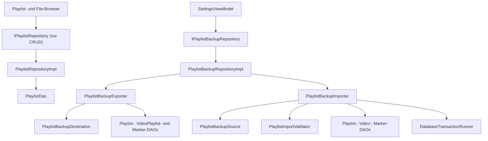

# NewAudio: Aufteilung von `PlaylistRepositoryImpl`

**Stand:** 14. Juli 2026
**Status:** Umgesetzt und lokal verifiziert; P30-Smoke optional ausstehend
**Risikoklasse:** mittel (`4/10`) bei sequenzieller Umsetzung
**Geltungsbereich:** ausschließlich Playlist-CRUD und Playlist-Backup/-Restore

## 1. Ziel

`PlaylistRepositoryImpl` wird so aufgeteilt, dass die Klasse ausschließlich die
laufenden CRUD-Operationen für Audio-Playlists verantwortet. Backup-Export,
Backup-Import, Eingabe-/Ausgabezugriff und Importvalidierung werden in getrennte,
gezielt testbare Komponenten verschoben.

Die Aufteilung darf das beobachtbare Verhalten der App nicht unbeabsichtigt
verändern:

- bestehende Backup-Dateien der Versionen 1 bis 4 bleiben importierbar;
- neue Exporte bleiben beim Format `version = 4`;
- Audio-Playlists, Video-Playlists, Videomarker und Settings werden weiterhin
  vollständig verarbeitet;
- Importstatistiken und `ImportFailure` behalten ihre heutige Bedeutung;
- ein abgelehnter Import schreibt weder teilweise noch vollständig in Room;
- bestehende UI-Abläufe und Meldungen in den Settings bleiben erhalten;
- die Aufteilung erfolgt in kleinen, kompilierbaren und einzeln rücksetzbaren
  Sprints.

## 2. Nicht Bestandteil dieses Plans

- keine Aufteilung von `MediaRepositoryImpl`;
- keine Änderung am Datenbankschema oder an Room-Migrationen;
- kein neues Backupformat und keine Erhöhung der Formatversion;
- keine Änderung der sichtbaren Settings-Oberfläche;
- keine Änderung an Gradient-, Theme- oder Compose-Tracing-Code;
- keine Verschlüsselung oder Kompression von Backups;
- keine umfassende Neugestaltung der Rückgabewerte des Exports; der bestehende
  `Boolean`-Vertrag bleibt zunächst erhalten;
- keine Optimierung der Media-Auflösungsreihenfolge während des Verschiebens;
- keine gleichzeitige Umsetzung des Media-Repository-Refactorings.

## 3. Bestätigte Ausgangslage

### Produktionscode

- `PlaylistRepositoryImpl.kt` umfasst derzeit ungefähr 516 Zeilen.
- Die Klasse implementiert gleichzeitig:
  - Playlist-CRUD und Sortierung;
  - Zuordnung und Sortierung von Songs;
  - Zusammenstellung und Serialisierung von Backups;
  - Zugriff auf `file://`- und `content://`-Ziele;
  - größenbegrenztes Lesen von Importquellen;
  - Deserialisierung und Validierung;
  - Auflösung verschobener Songs, Videos und Videomarker;
  - transaktionales Schreiben des Imports;
  - Zuordnung technischer Fehler zu `ImportFailure`.
- Die Implementierung injiziert aktuell vier DAOs, den
  `DatabaseTransactionRunner`, Android-`Context` und den IO-Dispatcher.
- `IPlaylistRepository` enthält sowohl CRUD- als auch Backupmethoden.
- `SettingsViewModel` ist der relevante Produktionsaufrufer für Import und
  Export.
- Playlist- und File-Browser-Code hängen für CRUD am Domaininterface
  `IPlaylistRepository`.
- Hilt bindet momentan genau eine Implementierung an `IPlaylistRepository`.

### Tests

- `PlaylistRepositoryImplTest` enthält derzeit elf direkte Tests.
- Vorhanden sind bereits wichtige Regressionstests für:
  - ungültiges JSON;
  - zukünftige Formatversionen;
  - exakte und überschrittene Byte-Grenzen;
  - Videogröße im Export;
  - Marker-Metadaten im Export;
  - Videoauflösung über Dateiname und Größe;
  - Markerauflösung über Pfad, Hash sowie Dateiname/Größe/Dauer;
  - Unterdrückung nahezu identischer Marker.
- `BackupExportImportTest` prüft Teile des Settings-ViewModel-Verhaltens.
- Nicht ausreichend charakterisiert sind aktuell insbesondere:
  - alle CRUD-Operationen der Repository-Implementierung;
  - Exportfehler und Coroutine-Cancellation;
  - Import-Rollback mit einem realen Room-Transaktionsrunner;
  - vollständige Validierungsgrenzen;
  - normale absolute Dateipfade ohne vorherige Normalisierung im ViewModel;
  - tatsächlicher `content://`-Zugriff auf einem Android-Gerät/Emulator.

### Vorbedingung für die Umsetzung

Im Worktree befinden sich derzeit unabhängige Settings-/Gradient-Änderungen.
Diese müssen vor Beginn des Refactorings separat committed oder anderweitig
sauber isoliert sein. Die Repository-Arbeit darf nicht mit diesen Änderungen in
einem Commit vermischt werden.

## 4. Zielarchitektur



### 4.1 `PlaylistRepositoryImpl`

Verantwortet danach nur:

- Laden und Abbilden von Playlists;
- Erstellen, Ändern, Löschen und Duplizieren;
- Playlist-Sortierung;
- Hinzufügen, Entfernen, Sortieren und Tauschen von Songs;
- Abbildung von DAO-Modellen auf Domainmodelle;
- Ausführung dieser Operationen auf dem IO-Dispatcher.

Die Klasse injiziert im Zielzustand nur noch:

- `PlaylistDao`;
- `@IoDispatcher CoroutineDispatcher`.

Sie enthält danach keine Importe oder Verwendungen von:

- `Context`, `Uri`, `InputStream`, `FileOutputStream` oder JSON;
- `VideoDao`, `VideoPlaylistDao` oder `VideoMarkerDao`;
- `DatabaseTransactionRunner`;
- Backup-Modellen oder `ImportFailure`.

### 4.2 `PlaylistBackupExporter`

Verantwortet:

- Lesen aller zu exportierenden Audio-Playlists und Songs;
- Lesen aller Video-Playlists und Videos;
- Lesen aller Videomarker;
- Abbildung in die bestehenden Exportmodelle;
- Einbettung der übergebenen `UserPreferences`;
- Serialisierung mit dem bestehenden Format Version 4;
- Schreiben über `PlaylistBackupDestination`;
- Rückgabe des kompatiblen `Boolean`-Ergebnisses;
- erneutes Werfen von `CancellationException`.

Nicht verantwortlich für:

- Validierung eingehender Backups;
- Import oder Room-Transaktionen;
- UI-Meldungen;
- Pfadnormalisierung im ViewModel.

### 4.3 `PlaylistBackupImporter`

Verantwortet:

- Lesen über `PlaylistBackupSource`;
- tolerantes JSON-Decoding mit `ignoreUnknownKeys = true`;
- Aufruf des Validators vor jeder Datenbankmutation;
- Auflösen vorhandener oder verschobener Songs und Videos;
- Auflösen und Deduplizieren von Videomarkern;
- Erzeugen der Importstatistik;
- Ausführen sämtlicher Datenbankmutationen in einer gemeinsamen Transaktion;
- Abbildung erwarteter Fehler auf das vorhandene `ImportResult`;
- erneutes Werfen von `CancellationException`.

Die bestehende Auflösungsreihenfolge bleibt verbindlich:

1. Songs: direkter Pfad;
2. Songs: Datei-Hash;
3. Songs: Dateiname und Größe;
4. Songs: existierende lokale Datei am alten Pfad;
5. Videos: direkter Pfad;
6. Videos: Dateiname und Größe;
7. Videos: existierende lokale Datei am alten Pfad;
8. Marker: Videopfad;
9. Marker: Datei-Hash;
10. Marker: Dateiname, Größe und Dauer.

### 4.4 `PlaylistImportValidator`

Ist eine möglichst plattformunabhängige, zustandslose Komponente und
verantwortet ausschließlich:

- erlaubte Formatversionen 1 bis 4;
- maximale Anzahl von Playlists, Medieneinträgen und Markern;
- maximale String-, Pfad-, Namens- und Hashlängen;
- erlaubte Pfadpräfixe;
- Zeit-, Größen- und Positionsbereiche;
- Farbcodes und numerische Bereiche importierter Settings;
- Erzeugen eines typisierten Validierungsfehlers mit zugehörigem
  `ImportFailure`.

Der Validator kennt keine DAOs, Android-Klassen, Streams oder Coroutines.

### 4.5 URI-/Dateiquellen

Für symmetrische und separat testbare I/O-Grenzen werden zwei kleine Ports
verwendet:

- `PlaylistBackupSource`
  - liest absolute Pfade, `file://` und `content://`;
  - erzwingt `Constants.Security.MAX_IMPORT_BYTES` auch bei Streams ohne bekannte
    Länge;
  - schließt Streams zuverlässig;
  - unterscheidet nicht gefunden, zu groß und allgemeine I/O-Fehler.
- `PlaylistBackupDestination`
  - schreibt absolute Pfade, `file://` und `content://`;
  - behandelt einen `null`-OutputStream als Fehler;
  - schließt und flush't den Stream zuverlässig;
  - enthält keine Serialisierungs- oder DAO-Logik.

Konkrete Android-Implementierungen dürfen `@ApplicationContext Context` und
`ContentResolver` verwenden. Exporter und Importer sehen nur die Ports.

### 4.6 Backup-Domainvertrag

Ein neues `IPlaylistBackupRepository` übernimmt:

```kotlin
suspend fun exportPlaylists(
    filePath: String,
    userPreferences: UserPreferences
): Boolean

suspend fun importPlaylists(filePath: String): ImportResult
```

`PlaylistBackupRepositoryImpl` ist eine sehr kleine Fassade, die an Exporter und
Importer delegiert. Diese zusätzliche Fassade verhindert, dass
`SettingsViewModel` direkt von Klassen aus der Data-Schicht abhängt.

`IPlaylistRepository` enthält im Zielzustand nur CRUD. `ImportResult`,
`ImportFailure` und die serialisierten Exportmodelle bleiben kompatibel; sie
können in thematisch passende Domain-Dateien verschoben werden, ohne ihre
Feldnamen oder Defaults zu verändern.

## 5. Geplanter Dateiscope

### Neue Produktionsdateien

- `app/src/main/java/com/example/newaudio/domain/repository/IPlaylistBackupRepository.kt`
- `app/src/main/java/com/example/newaudio/data/backup/PlaylistBackupRepositoryImpl.kt`
- `app/src/main/java/com/example/newaudio/data/backup/PlaylistBackupExporter.kt`
- `app/src/main/java/com/example/newaudio/data/backup/PlaylistBackupImporter.kt`
- `app/src/main/java/com/example/newaudio/data/backup/PlaylistImportValidator.kt`
- `app/src/main/java/com/example/newaudio/data/backup/PlaylistBackupSource.kt`
- `app/src/main/java/com/example/newaudio/data/backup/AndroidPlaylistBackupSource.kt`
- `app/src/main/java/com/example/newaudio/data/backup/PlaylistBackupDestination.kt`
- `app/src/main/java/com/example/newaudio/data/backup/AndroidPlaylistBackupDestination.kt`
- bei Bedarf eine kleine interne Datei für typisierte Backupfehler, beispielsweise
  `PlaylistBackupException.kt`.

### Zu ändernde Produktionsdateien

- `data/repository/PlaylistRepositoryImpl.kt`
- `domain/repository/IPlaylistRepository.kt`
- `domain/repository/PlaylistExportModels.kt`, nur falls Modelle aus der bisherigen
  Interface-Datei sauber zugeordnet werden müssen; keine Schemaänderung
- `di/RepositoryModule.kt`
- `feature/settings/SettingsViewModel.kt`

### Neue oder aufzuteilende Tests

- `PlaylistRepositoryImplCrudTest.kt`
- `PlaylistBackupSourceTest.kt`
- `PlaylistBackupDestinationTest.kt`
- `PlaylistImportValidatorTest.kt`
- `PlaylistBackupExporterTest.kt`
- `PlaylistBackupImporterTest.kt`
- `PlaylistBackupImporterIntegrationTest.kt`
- `PlaylistBackupRepositoryImplTest.kt`
- optional, aber für die Abschlussabnahme vorgesehen:
  `PlaylistBackupStorageInstrumentedTest.kt` mit einem testlokalen
  `ContentProvider`.

### Zu ändernde Testhilfen

- `FakePlaylistRepository` wird zu einem reinen CRUD-Fake.
- Ein neuer `FakePlaylistBackupRepository` übernimmt Import-/Exportzustände.
- Konstruktoren in `SettingsViewModelTest` und `BackupExportImportTest` werden auf
  den neuen Backup-Port umgestellt.

## 6. Sprintplan

## Sprint 0: Baseline und Characterization Tests

### Ziel

Das heutige Verhalten wird vor dem Verschieben vollständig genug festgehalten,
damit spätere Änderungen als Refactoring und nicht als unbemerkte
Funktionsänderung bewertet werden können.

### Arbeiten

1. Aktuellen Worktree sauber isolieren.
2. Bestehende elf Repository-Tests unverändert grün ausführen.
3. Fehlende CRUD-Characterization Tests ergänzen:
   - `createPlaylist` verwendet `maxPosition + 1`;
   - leere Datenbank beginnt bei Position 0;
   - Update bildet alle Domainfelder korrekt ab;
   - einzelnes und mehrfaches Löschen delegieren korrekt;
   - Duplizieren erhält Quell-ID und neuen Namen;
   - Playlist-Reihenfolge wird vollständig abgebildet;
   - einzelnes Hinzufügen verwendet nächste Position;
   - Batch-Hinzufügen erzeugt fortlaufende Positionen und genau einen DAO-Aufruf;
   - einzelnes und mehrfaches Entfernen delegieren korrekt;
   - Reorder nummeriert ab 0;
   - Swap schreibt genau beide betroffenen Zuordnungen;
   - Flow-Mapping für Playlists und Songs bleibt korrekt.
4. Backup-Characterization ergänzen:
   - Audio-Playlist mit Songmetadaten wird korrekt exportiert;
   - Settings werden im Container erhalten;
   - Exportcontainer besitzt weiterhin Version 4;
   - unbekannte JSON-Felder werden beim Import ignoriert;
   - Versionen 1, 2, 3 und 4 werden akzeptiert;
   - direkter Songpfad, Hash und Dateiname/Größe werden in der heutigen
     Priorität verwendet;
   - Statistikfelder entsprechen dem heutigen Verhalten;
   - Validierungsfehler verursachen keine DAO-Schreiboperation.
5. Aktuelle Testzahl und Laufzeit im Plan oder in einer separaten
   Verifikationsdatei festhalten.

### Tests

```powershell
.\gradlew.bat :app:testDebugUnitTest --tests "com.example.newaudio.data.repository.PlaylistRepositoryImplTest" --rerun-tasks
.\gradlew.bat :app:testDebugUnitTest --tests "com.example.newaudio.feature.settings.BackupExportImportTest" --rerun-tasks
.\gradlew.bat :app:assembleDebug
```

### Akzeptanzkriterien

- Alle vorhandenen und ergänzten Characterization Tests sind grün.
- Noch keine Produktionsverantwortung wurde verschoben.
- Die Backupversion und alle bestehenden Fehlercodes sind explizit durch Tests
  geschützt.
- Der Sprint kann als reiner Test-Commit zurückgesetzt werden.

## Sprint 1: URI-, Datei- und Streamzugriff extrahieren

### Ziel

Android- und Stream-I/O werden aus dem Repository entfernt und separat testbar.

### Arbeiten

1. `PlaylistBackupSource` und `AndroidPlaylistBackupSource` anlegen.
2. Folgende Eingabeformen ausdrücklich unterstützen:
   - absoluter Dateipfad wie `C:/...` beziehungsweise Android-Pfad `/...`;
   - `file://...`;
   - `content://...`.
3. Das heutige größenbegrenzte UTF-8-Lesen verschieben.
4. Vorbekannte Dateigröße und tatsächlich gelesene Bytes jeweils gegen
   `MAX_IMPORT_BYTES` prüfen.
5. `PlaylistBackupDestination` und Android-Implementierung anlegen.
6. OutputStream-`null`, Öffnungsfehler, Schreibfehler und Close-Fehler als
   Exportfehler behandeln.
7. Pfadnormalisierung aus `SettingsViewModel` noch nicht entfernen; zunächst
   Parallelkompatibilität herstellen.
8. Das bestehende Repository verwendet intern die neuen I/O-Komponenten, enthält
   Import-/Export-Orchestrierung aber weiterhin selbst.

### Unit- und Robolectric-Tests

#### Quelle

- vorhandene absolute Datei wird gelesen;
- `file://` wird gelesen;
- `content://` verwendet `ContentResolver.openInputStream`;
- nicht vorhandene Datei ergibt `NOT_FOUND`;
- `null`-InputStream ergibt `NOT_FOUND`;
- exakt `MAX_IMPORT_BYTES` wird akzeptiert;
- ein Byte darüber ergibt `TOO_LARGE`;
- unbekannte Streamlänge umgeht die Grenze nicht;
- ein während des Lesens ausgelöster I/O-Fehler wird nicht als ungültiges JSON
  fehlklassifiziert;
- Stream wird bei Erfolg und Fehler geschlossen;
- `CancellationException` wird nicht verschluckt.

#### Ziel

- absoluter Pfad wird vollständig geschrieben;
- `file://` wird vollständig geschrieben;
- `content://` verwendet `openOutputStream`;
- `null`-OutputStream führt zu `false` auf der öffentlichen Ebene;
- Schreibfehler führt zu `false`;
- Stream wird bei Erfolg und Fehler geschlossen;
- `CancellationException` wird erneut geworfen.

### Akzeptanzkriterien

- Im Repository existiert keine eigene Stream-Leseschleife mehr.
- Öffnen, Lesen, Schreiben und Schließen sind unabhängig von DAO-Logik testbar.
- Bestehende Import-/Export-Tests bleiben grün.
- Keine UI- oder Interfaceänderung ist erforderlich.

## Sprint 2: `PlaylistImportValidator` extrahieren

### Ziel

Sicherheits- und Formatvalidierung wird als reine, deterministische Komponente
isoliert.

### Arbeiten

1. Grenzwerte und `COLOR_PATTERN` in den Validator verschieben.
2. `validateImport`, `validatePreferences`, Pfad- und Stringprüfungen
   verschieben.
3. Einen internen typisierten Fehler verwenden, der genau ein `ImportFailure`
   trägt.
4. Sicherstellen, dass der Validator vollständig vor
   `transactionRunner.run { ... }` ausgeführt wird.
5. Keine Grenzwerte oder erlaubten Werte im selben Sprint verändern.

### Validator-Testmatrix

- Version 0 abgelehnt;
- Versionen 1 bis 4 akzeptiert;
- Version 5 und sehr große Versionen abgelehnt;
- exakt 1.000 Playlists akzeptiert, 1.001 abgelehnt;
- exakt 100.000 Medieneinträge akzeptiert, 100.001 abgelehnt;
- exakt 50.000 Marker akzeptiert, 50.001 abgelehnt;
- Namen, Texte, Pfade und Hashes jeweils exakt am Limit akzeptiert;
- jeweils ein Zeichen über dem Limit abgelehnt;
- NUL-Zeichen abgelehnt;
- absoluter Pfad, `file://` und `content://` akzeptiert;
- relativer oder leerer Medienpfad abgelehnt;
- negative Größe, Dauer oder Zeit abgelehnt;
- Markerposition größer als Dauer abgelehnt;
- ungültige Farbcodes abgelehnt;
- `NaN`, positive und negative Unendlichkeit bei Float-Settings abgelehnt;
- alle numerischen Settings-Grenzen exakt geprüft;
- leere optionale Musik-/Videoordner akzeptiert;
- ungültige optionale Pfade abgelehnt.

### Akzeptanzkriterien

- Der Validator importiert keine Android-, Room- oder Coroutine-Klasse.
- Jeder Ablehnungsfall liefert weiterhin den vorgesehenen `ImportFailure`.
- Kein abgelehnter Container erreicht eine Datenbankmutation.
- Repository- und Settings-Regressionstests bleiben grün.

## Sprint 3: `PlaylistBackupExporter` extrahieren

### Ziel

Die vollständige Exportpipeline besitzt genau einen klaren Eigentümer.

### Arbeiten

1. Erstellen von `PlaylistBackupExporter`.
2. Exportbezogene Abhängigkeiten aus `PlaylistRepositoryImpl` verschieben:
   - `PlaylistDao` für Audio-Playlists;
   - `VideoPlaylistDao`;
   - `VideoMarkerDao`;
   - `PlaylistBackupDestination`;
   - IO-Dispatcher.
3. Mapping in `PlaylistExportContainer` unverändert übernehmen.
4. Formatversion 4 und bestehende JSON-Feldnamen unverändert lassen.
5. Exporter fängt erwartete I/O-/Serialisierungsfehler ab und liefert `false`.
6. `CancellationException` wird vor einem allgemeinen Catch erneut geworfen.
7. `PlaylistRepositoryImpl.exportPlaylists` delegiert in diesem Sprint nur noch
   an den Exporter; das öffentliche Interface bleibt vorerst unverändert.

### Exporter-Tests

- leeres Backup enthält leere Audio-, Video- und Markerlisten;
- mehrere Audio-Playlists behalten Reihenfolge, Namen und `createdAt`;
- Songs behalten Pfad, Titel und Künstler;
- Video-Playlist behält Dauer und reale Dateigröße;
- Marker behalten Pfad, Hash, Dateiname, Größe, Dauer, Position und Zeitstempel;
- übergebene `UserPreferences` werden vollständig serialisiert;
- Container besitzt Version 4;
- Ausgabe kann wieder als `PlaylistExportContainer` gelesen werden;
- Ausgabe über absolute Datei, `file://` und `content://`;
- OutputStream kann nicht geöffnet werden;
- Schreiben schlägt nach einem Teil der Bytes fehl;
- DAO-Lesen schlägt fehl;
- `CancellationException` wird weitergegeben;
- der Exporter führt keine Importvalidierung und keine Schreibtransaktion aus.

### Akzeptanzkriterien

- Exportlogik befindet sich nicht mehr in `PlaylistRepositoryImpl`.
- Alle bisherigen Exporttests sind auf `PlaylistBackupExporterTest` übertragen
  oder als Integrationsschutz erhalten.
- JSON-Vertrag Version 4 ist unverändert.
- Der Sprint verändert keine Importschnittstelle.

## Sprint 4: `PlaylistBackupImporter` extrahieren

### Ziel

Lesen, Decoding, Validierung, Medienauflösung und transaktionale Wiederherstellung
werden als eigenständige Importpipeline gekapselt.

### Arbeiten

1. `PlaylistBackupImporter` erstellen.
2. Bestehendes tolerantes JSON-Decoding unverändert übernehmen.
3. Quelle und Validator injizieren.
4. Audio-, Video- und Markerauflösung in den Importer verschieben.
5. Statistikzählung in einem lokalen, nicht geteilten Importzustand halten.
6. Alle Room-Schreibvorgänge weiterhin in genau einem
   `DatabaseTransactionRunner.run` ausführen.
7. `restoredPreferences` nur über `ImportResult` zurückgeben; der Importer schreibt
   nicht direkt in DataStore.
8. Fehlerzuordnung unverändert übernehmen:
   - nicht gefunden → `NOT_FOUND`;
   - Bytegrenze → `TOO_LARGE`;
   - ungültiges JSON → `INVALID_FORMAT`;
   - unbekannte Version → `UNSUPPORTED_VERSION`;
   - Mengen-/Feldgrenze → `LIMIT_EXCEEDED`;
   - sonstiges I/O → `IO_ERROR`.
9. `CancellationException` immer erneut werfen.
10. `PlaylistRepositoryImpl.importPlaylists` delegiert in diesem Sprint nur noch
    an den Importer; das Interface bleibt noch kompatibel.

### Importer-Unit-Tests

#### Parsing und Fehler

- ungültiges JSON;
- leeres Dokument;
- gültiges JSON mit unbekannten Feldern;
- Versionen 1 bis 4;
- zukünftige Version;
- Quelle nicht gefunden;
- Quelle zu groß;
- I/O-Fehler;
- Cancellation.

#### Audioauflösung

- direkter Pfad gewinnt vor allen Fallbacks;
- Hash wird verwendet, wenn Pfad fehlt;
- Dateiname/Größe wird verwendet, wenn Pfad und Hash fehlen;
- existierende Datei am alten Pfad wird als letzter Fallback verwendet;
- nicht auflösbarer Song erhöht `songsNotFound`;
- Positionen bleiben entsprechend der Exportreihenfolge erhalten.

#### Videoauflösung

- direkter Pfad;
- Dateiname/Größe;
- existierende Datei am alten Pfad;
- nicht auflösbares Video;
- Positionen bleiben erhalten.

#### Markerauflösung

- direkter Videopfad;
- Hash-Fallback;
- Dateiname-/Größe-/Dauer-Fallback;
- nicht auflösbarer Marker;
- Duplikat innerhalb einschließlich 1.000 ms wird übersprungen;
- Abstand größer als 1.000 ms wird importiert;
- Position wird auf den gültigen Dauerbereich begrenzt;
- Video-Metadaten haben Vorrang, wenn sie gültig sind;
- Export-Metadaten dienen als Fallback.

#### Transaktion und Statistik

- alle Writes befinden sich innerhalb des Transaktionsblocks;
- Validatorfehler führt zu null Writes;
- Fehler beim zweiten Playlist-Write wird als Fehler zurückgegeben;
- Statistik wird bei einem fehlgeschlagenen Import nicht teilweise veröffentlicht;
- `restoredPreferences` wird bei Erfolg zurückgegeben;
- bei Fehler wird keine Preference zur Wiederherstellung gemeldet.

### Room-Integrationstest

Mit einer In-Memory-Room-Datenbank und echtem
`RoomDatabaseTransactionRunner`:

1. Backup mit mindestens einer Audio-Playlist, einer Video-Playlist und einem
   Marker importieren.
2. Nach Erfolg sämtliche Tabelleninhalte und Reihenfolgen prüfen.
3. In einem zweiten Test während eines späteren Imports gezielt einen Fehler
   auslösen.
4. Nach dem Fehler sicherstellen, dass keine der vorher in dieser Transaktion
   geschriebenen Zeilen vorhanden ist.

### Akzeptanzkriterien

- Importlogik befindet sich nicht mehr in `PlaylistRepositoryImpl`.
- Validierung läuft vor der ersten Mutation.
- Der echte Room-Rollback ist durch mindestens einen Integrationstest belegt.
- Alle bestehenden Importfälle bleiben grün.
- Formatversion und Auflösungsreihenfolge sind unverändert.

## Sprint 5: Interface Segregation, Hilt und Settings-Migration

### Ziel

Im finalen Produktionsvertrag ist `IPlaylistRepository` nur noch für CRUD
zuständig; Settings verwenden einen eigenen Backup-Port.

### Arbeiten

1. `IPlaylistBackupRepository` anlegen.
2. `PlaylistBackupRepositoryImpl` als kleine delegierende Fassade anlegen.
3. Import-/Exportmethoden aus `IPlaylistRepository` entfernen.
4. `PlaylistRepositoryImpl` auf `PlaylistDao` und IO-Dispatcher reduzieren.
5. Hilt-Binding für `IPlaylistBackupRepository` ergänzen.
6. Bestehendes Hilt-Binding für `IPlaylistRepository` unverändert für CRUD
   erhalten.
7. `SettingsViewModel` von `IPlaylistRepository` auf
   `IPlaylistBackupRepository` umstellen.
8. Doppelte Pfadnormalisierung aus dem ViewModel entfernen, sobald Source und
   Destination absolute Pfade selbst sicher akzeptieren.
9. `FakePlaylistRepository` auf CRUD reduzieren.
10. `FakePlaylistBackupRepository` erstellen und Settings-Tests migrieren.
11. Keine Änderung an Meldungstexten, Events oder Preference-Restore vornehmen.

### Tests

- `PlaylistBackupRepositoryImpl` delegiert Export exakt einmal;
- `PlaylistBackupRepositoryImpl` delegiert Import exakt einmal;
- Settings-Export reicht aktuelle Preferences weiter;
- `notifyResult = false` erzeugt weiterhin kein Event;
- Exporterfolg und -fehler erzeugen weiterhin die korrekten UI-Ereignisse;
- jeder `ImportFailure` wird weiterhin auf die bestehende Meldung abgebildet;
- erfolgreiche importierte Settings werden weiterhin über den vorhandenen
  Restore-UseCase angewendet;
- fehlgeschlagener Import verändert Settings nicht;
- Playlist- und FileBrowser-Tests kompilieren mit dem verkleinerten CRUD-Port;
- Hilt-Debugbuild kann alle neuen Abhängigkeiten auflösen.

### Akzeptanzkriterien

- `IPlaylistRepository` enthält keine Backupmethoden mehr.
- `SettingsViewModel` importiert keinen konkreten Typ aus `data.backup`.
- `PlaylistRepositoryImpl` enthält ausschließlich CRUD.
- Alle ViewModel-, UseCase- und Repository-Tests sind grün.
- `assembleDebug` meldet keine Hilt-/KSP-Fehler.

## Sprint 6: Bereinigung und vollständige automatisierte Abnahme

### Ziel

Veraltete Delegationen und Tests werden entfernt; das Ergebnis wird statisch und
funktional vollständig verifiziert.

### Arbeiten

1. Nicht mehr verwendete Imports, Konstanten und Hilfsfunktionen aus
   `PlaylistRepositoryImpl` entfernen.
2. Den alten gemischten `PlaylistRepositoryImplTest` in klar benannte Tests
   aufteilen oder auf reine Integrationsfälle reduzieren.
3. Sicherstellen, dass keine Backupklasse versehentlich UI- oder
   Feature-Abhängigkeiten besitzt.
4. Sicherstellen, dass der Validator keine Android-Abhängigkeit besitzt.
5. Mit `rg` prüfen, dass nur der neue Backup-Port Import-/Exportmethoden anbietet.
6. Test- und Produktionsdateigrößen dokumentieren.
7. Kover-/Coverage-Bericht verwenden, falls die bestehende Buildkonfiguration
   dies bereits unterstützt; keine neue Coverage-Bibliothek nur für diesen
   Refactor einführen.

### Statische Prüfungen

```powershell
rg -n "exportPlaylists|importPlaylists" app/src/main app/src/test
rg -n "Context|Uri|InputStream|Json|VideoDao|VideoPlaylistDao|VideoMarkerDao|DatabaseTransactionRunner" app/src/main/java/com/example/newaudio/data/repository/PlaylistRepositoryImpl.kt
```

Die zweite Suche muss für `PlaylistRepositoryImpl.kt` ohne Treffer enden.

### Vollständige Build- und Testmatrix

```powershell
.\gradlew.bat :app:testDebugUnitTest --rerun-tasks
.\gradlew.bat :app:lintDebug
.\gradlew.bat :app:assembleDebug
.\gradlew.bat :app:assembleRelease
.\gradlew.bat :app:assembleDebugAndroidTest
```

Wenn der instrumentierte Storage-Test umgesetzt wurde und der dedizierte AVD
`newaudio` läuft:

```powershell
.\gradlew.bat :app:connectedDebugAndroidTest
```

### Akzeptanzkriterien

- Unit-Tests, Lint, Debug- und Release-Build sind erfolgreich.
- Keine Hilt-, Room- oder Serialization-Warnung wurde neu eingeführt.
- Es gibt keine gemischte Backup-/CRUD-Verantwortung mehr.
- Alte und neue Tests prüfen nicht unnötig dieselben Implementierungsdetails.
- Keine unabhängige Settings-/Gradient-Änderung ist Teil der Refactor-Commits.

## Sprint 7: Emulator-Smoke-Test und Abschlussdokumentation

### Ziel

Die automatischen Tests werden durch einen realen End-to-End-Ablauf auf dem für
NewAudio vorgesehenen Emulator ergänzt.

### Zielgerät

- dedizierter AVD `newaudio`;
- 4 GB RAM und 12 GB Datenträger gemäß Projektvorgabe;
- aktuelle Debug-APK aus demselben Commitstand.

### Manueller Smoke-Ablauf

1. App frisch starten und vorhandene Bibliothek laden.
2. Mindestens zwei Audio-Playlists mit unterschiedlicher Songreihenfolge anlegen.
3. Falls Videos vorhanden sind, eine Video-Playlist und einen Marker anlegen.
4. Eine sichtbare, reversible Einstellung ändern.
5. Backup über den Android-Dokumentpicker als `content://` exportieren.
6. Exportdatei außerhalb der App auf gültiges JSON und `version = 4` prüfen.
7. Eine der Test-Playlists verändern oder löschen.
8. Backup über den Dokumentpicker importieren.
9. Prüfen:
   - Audio-Playlistnamen und Reihenfolgen;
   - Video-Playlist und Videoreihenfolge;
   - Markerposition;
   - wiederhergestellte Einstellung;
   - Erfolgsmeldung.
10. Ungültige JSON-Datei importieren und prüfen:
    - verständliche Fehlermeldung;
    - keine neue Playlist;
    - keine veränderten Settings.
11. Übergroßen Import beziehungsweise entsprechenden automatisierten Providerfall
    prüfen.
12. Dokumentpicker abbrechen und sicherstellen, dass kein Fehlerzustand bleibt.
13. App beenden, neu starten und den finalen Zustand erneut prüfen.

### Optionaler P30-Smoke

Da das Refactoring Android-URI-I/O berührt, ist vor einem Produktionsrelease ein
kurzer P30-Test sinnvoll. Er ist kein Blocker für den lokalen Refactor-Commit,
aber ein Blocker für die Releasefreigabe, wenn Import/Export auf diesem Gerät ein
produktiver Ablauf ist.

### Abschlussdokumentation

- umgesetzte Sprints und Commit-IDs;
- ausgeführte Testbefehle und Ergebnisse;
- Emulator/API-Level;
- geprüfte Backupversionen;
- bekannte Restpunkte oder bewusst nicht veränderte Verhaltensweisen.

## 7. Verbindliche Testmatrix nach Verantwortlichkeit

| Komponente | Unit | Robolectric | Room-Integration | Instrumentiert/Smoke |
|---|---:|---:|---:|---:|
| `PlaylistRepositoryImpl` CRUD | ja | nein | optional | indirekt |
| `PlaylistBackupSource` | ja | ja | nein | ja |
| `PlaylistBackupDestination` | ja | ja | nein | ja |
| `PlaylistImportValidator` | ja, vollständig | nein | nein | nein |
| `PlaylistBackupExporter` | ja | bei Android-I/O | nein | ja |
| `PlaylistBackupImporter` | ja | bei Dateifallbacks | ja | ja |
| `PlaylistBackupRepositoryImpl` | ja | nein | nein | indirekt |
| `SettingsViewModel` | ja | nein | nein | ja |

## 8. Format- und Sicherheitsvertrag

Folgende Regeln sind während aller Sprints unveränderlich:

1. Exportformat bleibt Version 4.
2. Feldnamen und Defaultwerte der serialisierten Modelle bleiben unverändert.
3. Unbekannte Felder werden beim Import ignoriert.
4. Zukünftige Versionen werden abgelehnt.
5. Die Importdatei darf `MAX_IMPORT_BYTES` nicht überschreiten.
6. Die Byte-Grenze gilt auch für `content://`-Streams ohne bekannte Länge.
7. Validierung findet vollständig vor dem ersten Write statt.
8. Alle Writes eines akzeptierten Imports liegen in einer Room-Transaktion.
9. Ein Transaktionsfehler darf keine Teil-Playlists oder Teil-Marker hinterlassen.
10. `CancellationException` wird nie als normaler Import-/Exportfehler verschluckt.
11. Streams werden in allen Erfolgs- und Fehlerpfaden geschlossen.
12. Importierte Settings werden nur über den bestehenden Settings-Restore-Ablauf
    angewendet.
13. Backupkomponenten protokollieren keine vollständigen Backupinhalte oder
    privaten Medienpfade unnötig.

## 9. Commitstrategie

Empfohlene getrennte Commits:

1. `test: characterize playlist repository behavior`
2. `refactor: isolate playlist backup storage access`
3. `refactor: extract playlist import validation`
4. `refactor: extract playlist backup exporter`
5. `refactor: extract playlist backup importer`
6. `refactor: separate playlist crud and backup contracts`
7. `test: verify playlist backup integration`

Jeder Commit muss kompilieren und seine fokussierten Tests bestehen. Kein Commit
darf gleichzeitig `MediaRepositoryImpl` verändern.

## 10. Rollbackstrategie

- Sprints werden in der angegebenen Reihenfolge umgesetzt.
- Bis Sprint 4 bleibt der alte öffentliche `IPlaylistRepository`-Vertrag bestehen;
  Extraktionen werden durch Delegation angebunden.
- Die Interface-Segregation erfolgt erst, nachdem Exporter und Importer durch
  eigene Tests stabil sind.
- Bei Fehlern kann jeder Extraktionscommit einzeln zurückgenommen werden, ohne
  Backupformat oder Datenbankschema zurückzurollen.
- Eine bereits vom Nutzer erzeugte Version-4-Backupdatei darf durch keinen
  Rollback unlesbar werden.

## 11. Definition of Done

Der Plan gilt erst als vollständig umgesetzt, wenn alle folgenden Punkte erfüllt
sind:

- [x] `PlaylistRepositoryImpl` enthält nur Playlist- und Song-CRUD.
- [x] `PlaylistRepositoryImpl` injiziert nur `PlaylistDao` und IO-Dispatcher.
- [x] `IPlaylistRepository` enthält keine Import-/Exportmethoden.
- [x] `IPlaylistBackupRepository` ist vorhanden und über Hilt gebunden.
- [x] `PlaylistBackupExporter` besitzt die gesamte Exportorchestrierung.
- [x] `PlaylistBackupImporter` besitzt die gesamte Importorchestrierung.
- [x] `PlaylistImportValidator` ist Android- und Room-unabhängig.
- [x] URI-/Dateizugriff ist hinter Source und Destination isoliert.
- [x] Backups der Versionen 1 bis 4 sind durch Tests geschützt.
- [x] Exporte bleiben bei Version 4.
- [x] Importgrenzen sind an und unmittelbar über den relevanten Grenzen getestet.
- [x] Cancellation wird bei Import und Export weitergegeben.
- [x] Ein echter Room-Rollback ist getestet.
- [x] Settings verwenden ausschließlich den neuen Backup-Domainport.
- [x] CRUD-, Backup-, Settings- und Integrationsprüfungen sind grün.
- [x] Produktions-Lint, Debug- und Release-Build sind erfolgreich.
- [x] `content://` wurde auf dem AVD `newaudio` praktisch geprüft.
- [x] Unabhängige Settings-/Gradient-Arbeiten blieben inhaltlich erhalten und
  wurden nicht in die Repository-Komponenten übernommen; ein Commit wurde in
  diesem Arbeitsschritt nicht erstellt.
- [x] Umsetzung und Testergebnisse sind dokumentiert.

## 12. Erwartetes Restrisiko nach Umsetzung

Bei vollständiger Einhaltung dieses Plans sinkt das strukturelle Risiko deutlich.
Das verbleibende Risiko liegt hauptsächlich bei herstellerspezifischen
`ContentResolver`-/DocumentProvider-Eigenheiten und historischen Backupdateien,
die außerhalb der automatisierten Fixtures liegen. Deshalb bleiben der
instrumentierte `content://`-Test und ein kurzer P30-Smoke vor einer
Produktionsfreigabe sinnvoll.

## 13. Umsetzungsergebnis vom 14. Juli 2026

### Architektur

- `PlaylistRepositoryImpl.kt` wurde von rund 516 auf 124 Zeilen reduziert.
- Die Klasse injiziert nur noch `PlaylistDao` und den IO-Dispatcher.
- Backup-Import und -Export wurden aus `IPlaylistRepository` entfernt.
- `IPlaylistBackupRepository` wurde als eigener Domainport eingeführt und über
  Hilt an `PlaylistBackupRepositoryImpl` gebunden.
- Export, Import, Validierung, Quelle und Ziel liegen als getrennte Komponenten
  unter `data/backup`.
- Die Settings reichen absolute Pfade und Dokumentpicker-URIs unverändert an den
  Backup-Port weiter. Die frühere temporäre Datei- und Kopierlogik im ViewModel
  wurde entfernt.
- `CancellationException` wird von Exporter, Importer und ViewModel nicht als
  normaler Fehler verschluckt.
- `MediaRepositoryImpl` wurde nicht verändert.

### Automatisierte Verifikation

Folgende Prüfungen waren erfolgreich:

```powershell
.\gradlew.bat :app:testDebugUnitTest
.\gradlew.bat :app:lintAnalyzeDebug
.\gradlew.bat :app:lintDebug `
  -x :app:lintAnalyzeDebugUnitTest `
  -x :app:lintAnalyzeDebugAndroidTest
.\gradlew.bat :app:assembleDebug
.\gradlew.bat :app:assembleRelease
.\gradlew.bat :app:assembleDebugAndroidTest
```

Ergebnis der JVM-Suite:

- 327 Tests in 52 Suites;
- 0 Fehler;
- 0 Fehlschläge;
- 0 übersprungene Tests.

Der auf `emulator-5554` festgelegte Instrumentationlauf auf dem AVD `newaudio`
war ebenfalls erfolgreich:

```powershell
$env:ANDROID_SERIAL='emulator-5554'
.\gradlew.bat :app:connectedDebugAndroidTest `
  '-Pandroid.testInstrumentationRunnerArguments.class=com.example.newaudio.data.backup.PlaylistBackupStorageInstrumentedTest,com.example.newaudio.data.backup.PlaylistBackupImporterIntegrationTest'
```

Ausgeführt wurden drei Tests:

1. echter `content://`-Roundtrip über den Debug-`DocumentsProvider`;
2. Import über echte In-Memory-Room-DAOs;
3. echter Room-Transaktions-Rollback nach absichtlich ausgelöstem Fehler.

### Sichtbarer Emulator-Smoke

- aktuelle Debug-APK auf dem AVD `newaudio` installiert;
- App ohne `AndroidRuntime`-Crash gestartet;
- Settings → System → Backup geöffnet;
- Export über `ActivityResultContracts.CreateDocument` ausgeführt;
- `/sdcard/Music/newaudio_playlists.json` erfolgreich erzeugt;
- Datei hatte 620 Byte, gültiges JSON und `version = 4`;
- dieselbe Datei anschließend über den Android-Dokumentpicker importiert;
- App meldete erfolgreich `Import complete: 0 playlists restored`; der frische
  Emulator enthielt erwartungsgemäß keine Playlists;
- kein Crash oder sichtbarer Fehler während Export und Import.

### Lint-Hinweis

Der normale kombinierte `lintDebug`-Aufruf stieß beim Analysieren von
Testquellen auf einen internen Kotlin-FIR/Lint-Analyzer-Crash. Betroffen waren
die bereits vorhandene `PlayerListenerDelegateTest.kt` und der neue
Room-Integrationstest. Produktions-Lint ohne die beiden Test-Analyzer lief
erfolgreich und erzeugte den Debug-Lintbericht; sämtliche Testquellen wurden
zusätzlich erfolgreich kompiliert und ausgeführt. Es wurde deshalb keine
produktive Lint-Warnung unterdrückt.

### Noch nicht ausgeführt

- optionaler realer P30-Smoke vor einer Produktionsfreigabe;
- Commit-Erstellung; diese war nicht Bestandteil des Umsetzungsauftrags.
